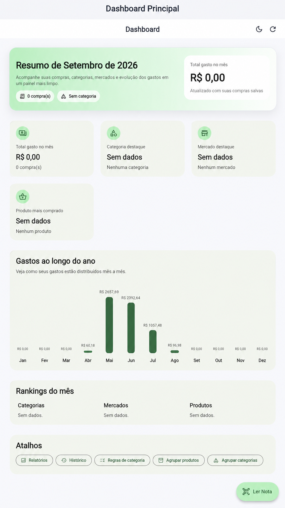
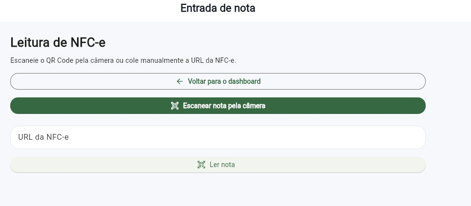
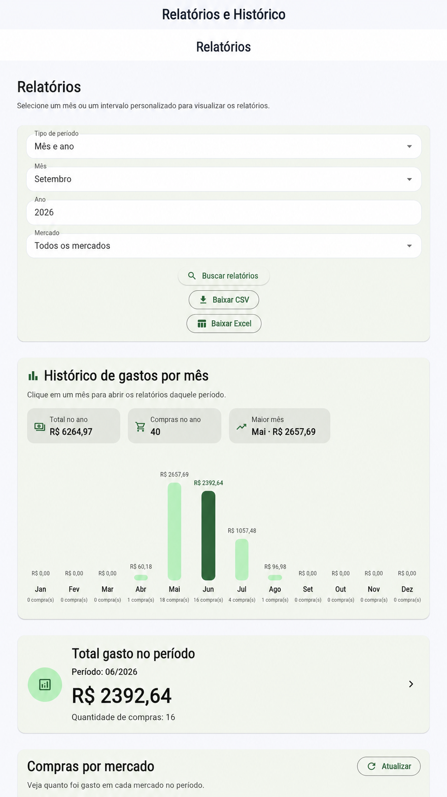

# compras2.0

Sistema web local para leitura de QR Code de NFC-e, com extração automática de produtos e armazenamento em MySQL.

## Demonstração

### Tela principal

### Leitura de QR Code

### Relatórios

## 📋 Sobre o Projeto

O **compras2.0** é um sistema web local que automatiza o registro de compras de supermercado a partir do QR Code presente na **Nota Fiscal Eletrônica de Consumidor (NFC-e)**. 

O sistema utiliza a câmera do notebook para ler o código, extrai automaticamente os dados da nota (mercado, produtos, valores, etc.) e armazena tudo em um banco de dados MySQL, permitindo gerar relatórios de gastos e histórico de compras.

## ✨ Funcionalidades

- Leitura de QR Code da NFC-e pela câmera do notebook
- Entrada manual da URL da nota (caso a câmera falhe)
- Extração automática de todos os produtos da compra
- Edição manual dos dados após a leitura
- Bloqueio de notas fiscais duplicadas
- Histórico de compras
- Relatórios de gastos (mensal, por mercado, por categoria e produtos mais comprados)
- Não armazena dados sensíveis do consumidor (como CPF)

## 🛠️ Tecnologias Utilizadas

| Camada       | Tecnologia                  |
|--------------|-----------------------------|
| Frontend     | Flutter Web + html5-qrcode  |
| Backend      | Spring Boot                 |
| Banco de Dados | MySQL                     |
| Integração   | JavaScript Interop          |

## 📁 Estrutura do Projeto

compras2.0/
│
├── backend/           # API Spring Boot
├── frontend/          # Flutter Web
├── database/          # Scripts SQL
├── docs/              # Documentação (SDD)
│
├── README.md
└── .gitignore

📄 Documentação

O documento completo de arquitetura e design do sistema está disponível na pasta Documentação/.

👤 Privacidade
O sistema foi projetado para não armazenar dados sensíveis do consumidor (como CPF ou nome do comprador), focando apenas nos dados da compra e dos produtos.

📌 Status do Projeto

Versão atual: 1.0
Tipo: Sistema Web Local
Fase: protótipo funcional em evolução

Projeto pessoal
Maio/2026

